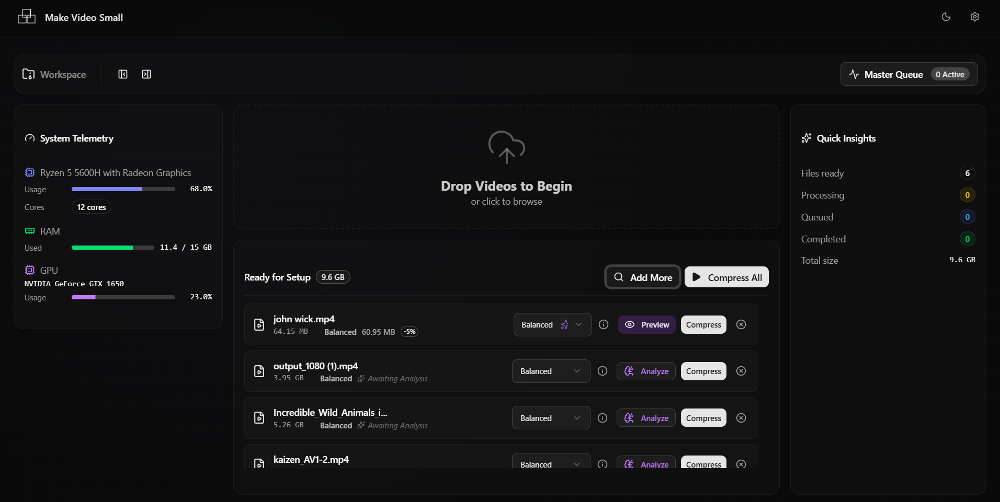

# Make Video Small

A professional desktop application designed for high-efficiency AV1 video compression. 

Make Video Small provides a sleek, modern interface for advanced video encoding, bridging the gap between complex command-line tools like FFmpeg/Av1an and an intuitive user experience. It allows content creators, developers, and professionals to significantly reduce video file sizes while maintaining near-lossless visual quality.



## Core Features

* **Next-Generation AV1 Encoding:** Utilizes the AV1 codec to achieve up to 90% reduction in file size compared to standard H.264 formats.
* **Hardware Acceleration:** Native support for GPU-accelerated encoding (NVIDIA NVENC, AMD AMF) for rapid processing times.
* **Intelligent Analysis:** Built-in hardware and media analysis to automatically recommend the optimal encoding parameters for a given file.
* **Local & Private:** 100% offline processing. No video files are ever uploaded to a server, ensuring complete data privacy.
* **Batch Processing:** Queue multiple videos for sequential compression without manual intervention.
* **Seamless Updates:** Integrated auto-updater ensures you always have the latest engine improvements and bug fixes.

## Technology Stack

This application is built using a modern, decoupled architecture:

* **Frontend:** React 19, Tailwind CSS, and Radix UI components for a highly responsive, dark-mode native interface.
* **Desktop Wrapper:** Electron (v38) providing a secure, sandboxed environment with strict IPC (Inter-Process Communication) bridging.
* **Compression Engine:** A custom Python backend managing FFmpeg and Av1an processes.
* **Build System:** Vite for fast frontend compilation, TypeScript for type safety, and `electron-builder` for generating professional NSIS Windows installers.

## Installation (End Users)

To use Make Video Small, you do not need to build it from source.

1. Navigate to the [Releases page](https://github.com/ghostofweb/makevideosmall/releases).
2. Download the latest `MakeVideoSmall_Setup_vX.X.X.exe`.
3. Run the installer and follow the standard setup wizard.

## Local Development

If you wish to contribute or modify the application, follow these steps to set up your local environment.

### Prerequisites
* [Node.js](https://nodejs.org/) (v18 or higher recommended)
* Git

### Setup
1. Clone the repository:
   ```bash
   git clone [https://github.com/ghostofweb/makevideosmall.git](https://github.com/ghostofweb/makevideosmall.git)
   cd makevideosmall